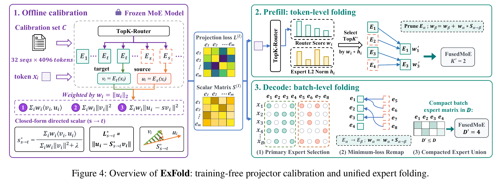
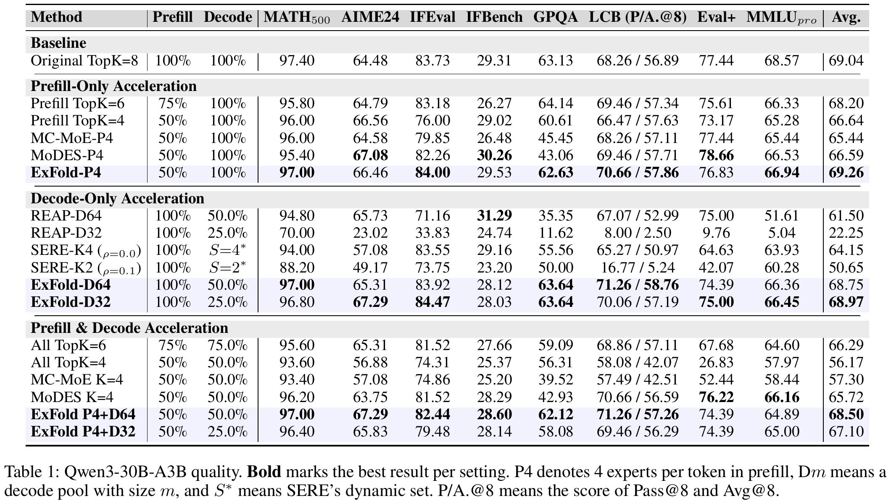
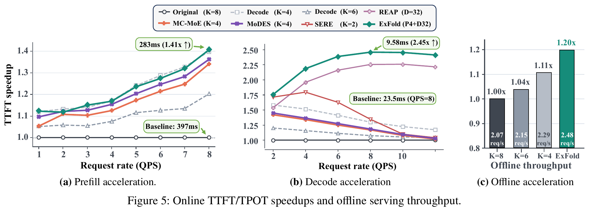

# ExFold

Official implementation of **ExFold: Unified Expert Folding for Training-Free
MoE Prefill-Decode Acceleration**.

ExFold accelerates Mixture-of-Experts inference by folding omitted routed
experts into retained experts through calibrated, directed scalar projections.
It is training-free, supports both prefill and decode, and applies the routing
transformation before the fused MoE operator so omitted expert outputs are not
materialized.

## Method



For a source expert output `u_i`, target expert output `v_i`, and calibration
weight `w_i`, ExFold fits one scalar for each directed expert pair:

```text
s*(source -> target) = sum_i w_i <u_i, v_i>
                       / (sum_i w_i ||v_i||_2^2 + lambda)
```

At inference time:

- **Prefill:** retain the highest router-score routes for each token and fold
  each omitted route into its minimum-loss retained target.
- **Decode:** rank experts in the current batch by accumulated
  `router_score * calibrated_output_norm`, retain at most `D`, and remap each
  omitted route to its minimum-loss retained target.
- **Execution:** send only the transformed routes and weights to the standard
  fused MoE operator.

DeepSeek-V4-Flash uses the final unclipped scalar matrix and confidence-aware
prefill transfer. Qwen3 uses the scalar calibration configuration reported in
the paper.

## Results

### Quality



The repository also includes the final DeepSeek-V4-Flash calibration matrix and
the matched evaluation entry points used for its benchmark suite.

### Serving Speed



The supplied scripts reproduce the phase-isolated TTFT and TPOT measurements
and the end-to-end offline throughput benchmark.

## Requirements

- Linux with Python 3.10 or newer.
- CUDA 12.8 or newer and a compatible NVIDIA driver.
- Local model weights, code, and benchmark data for latency measurements.
- NVIDIA H800 GPUs for reproducing the reported paper latency numbers.

The reproduction entry points use the following matched environments:

| Target | vLLM | Engine | Tensor parallelism | Hardware |
|---|---:|---|---:|---|
| Qwen3 quality and prefill speed | 0.10.2 | V0 | 4 | 4 x H800 |
| Qwen3 decode speed | 0.11.0 | V1 | 1 | 1 x H800 |
| DeepSeek-V4 quality | 0.26.0 | V1 + CUDA Graph | 8 | 8 compatible GPUs |
| DeepSeek-V4 speed | 0.26.0 | V1 + CUDA Graph | 4 | 4 x H800 |

Create the matching environments with one command:

```bash
bash scripts/install.sh qwen3
bash scripts/install.sh deepseek-v4
# Or install every environment:
bash scripts/install.sh all
```

Install the locked OpenCompass evaluation environment into the active model
environment with:

```bash
PYTHON=.venv-qwen010/bin/python bash scripts/setup_opencompass.sh
```

The setup script checks out the evaluation revision expected by the bundled
configs automatically. The DeepSeek quality anchors used during development
were collected with the same protocol on vLLM 0.20.1.dev; the public launcher
targets vLLM 0.26.0 for upstream DeepSeek-V4 and CUDA Graph support.

If Qwen3 TP4 stalls during NCCL initialization, set `DISABLE_NCCL_NVLS=1`.
This was required on one reproduction host and does not alter model
computation.

## Repository

```text
artifacts/                 final Qwen3 and DeepSeek-V4 calibration matrices
exfold/qwen3/              Qwen3 calibration, Triton kernels, and vLLM patch
exfold/deepseek_v4/        DeepSeek-V4 CUDA kernels and vLLM patch
evaluation/                locked OpenCompass protocols and result summaries
scripts/                   serving, quality, and speed reproduction commands
tests/                     CPU, CUDA, and CUDA Graph correctness checks
```

Validate the included runtime artifacts before use:

```bash
PYTHONPATH=$PWD python scripts/validate_artifacts.py
sha256sum -c artifacts/SHA256SUMS
```

## Serve

The launchers expose OpenAI-compatible endpoints for Original and ExFold:

```bash
# Qwen3 paper-quality operating point: P4+D64.
MODEL_PATH=/models/Qwen3-30B-A3B \
PYTHON=.venv-qwen010/bin/python \
bash scripts/serve_qwen3.sh quality exfold

# DeepSeek-V4-Flash report operating point: P3+D64.
MODEL_PATH=/models/DeepSeek-V4-Flash \
PYTHON=.venv-dsv4/bin/python \
bash scripts/serve_deepseek_v4.sh quality exfold
```

Replace `exfold` with `original` for a matched unmodified service. Override the
budgets with `PREFILL_BUDGET` / `DECODE_BUDGET` for Qwen3 and
`EXFOLD_PREFILL_TOPK` / `EXFOLD_DECODE_EXPERT_BUDGET` for DeepSeek-V4.

### SGLang deployment image

`docker/sglang-dsv4/Dockerfile` packages the DeepSeek-V4-Flash SGLang runtime,
the final calibration matrix, and the Hopper CUDA extension. The model weights
remain mounted at `/workspace/models/DeepSeek-V4-Flash`. Launch Original with:

```bash
exfold-sglang-serve --enable-exfold false
```

Launch an ExFold operating point by setting the three deployment parameters:

```bash
exfold-sglang-serve \
  --enable-exfold true \
  --exfold-prefill-k 4 \
  --exfold-decode-k 128
```

Ordinary `sglang serve` options can be appended to override the packaged
DeepSeek-V4 defaults. See `docker/sglang-dsv4/README.md` for the complete launch
contract. DeepSeek-V4 HashTopK layers remain unmodified in every ExFold mode.

## Quality Reproduction

One command starts the selected service, waits until it is healthy, evaluates
the complete suite, and shuts the service down:

```bash
# Qwen3: MATH500, AIME24@32, IFEval, IFBench, GPQA-D,
# LiveCodeBench v5@8, HumanEval+, and MMLU-Pro.
MODEL_PATH=/models/Qwen3-30B-A3B \
PYTHON=.venv-qwen010/bin/python \
bash scripts/reproduce_quality.sh qwen3 exfold

# DeepSeek-V4: IFEval, IFBench, MMLU-Pro, GPQA-D, MATH500 4-shot,
# HumanEval+ avg@8, LiveCodeBench v6, AIME25@8, and AIME26@8.
MODEL_PATH=/models/DeepSeek-V4-Flash \
PYTHON=.venv-dsv4/bin/python \
bash scripts/reproduce_quality.sh deepseek-v4 exfold
```

Run `original` with the same command for the denominator. A comma-separated
third argument evaluates only selected tasks:

```bash
bash scripts/reproduce_quality.sh deepseek-v4 exfold ifeval,ifbench
```

The DeepSeek matrix was calibrated from 64 unlabeled inputs: 56 general
instruction/code/math inputs and 8 benchmark inputs without labels. It is a
transductive, benchmark-aware calibration artifact and does not modify model
weights. Preserve this distinction when reporting results.

## Speed Reproduction

The speed launchers always run Original and ExFold with matched requests and
write the raw benchmark JSON and `summary.csv`:

```bash
# Qwen3: 8K prefill QPS 1..8 and 1x256 decode QPS 2..12.
MODEL_PATH=/models/Qwen3-30B-A3B \
QWEN3_PREFILL_PYTHON=$PWD/.venv-qwen010/bin/python \
QWEN3_DECODE_PYTHON=$PWD/.venv-qwen011/bin/python \
DISABLE_NCCL_NVLS=1 \
bash scripts/reproduce_qwen3_speed.sh

# DeepSeek-V4: no-queue 8K TTFT and saturated 1x256 decode.
MODEL_PATH=/models/DeepSeek-V4-Flash \
DEEPSEEK_V4_PYTHON=$PWD/.venv-dsv4/bin/python \
bash scripts/reproduce_deepseek_v4_speed.sh
```

The benchmark workloads are intentionally phase-specific:

| Model | Metric | Workload | ExFold setting |
|---|---|---|---|
| Qwen3 | TTFT | 8192 input, 1 output, QPS 1-8 | P4 |
| Qwen3 | TPOT | 1 input, 256 output, QPS 2-12 | calibrated static D32 |
| DeepSeek-V4 | TTFT | 8192 input, 1 output, concurrency 1 | P3 |
| DeepSeek-V4 | TPOT | 1 input, 256 output, QPS 64 | D64 |

The Qwen3 quality path uses dynamic batch-level decode selection. Its decode
speed profile freezes the calibrated norm-selected D32 pool so the benchmark
isolates the source-to-target remap and fused-MoE reduction used for the paper
latency result. Do not use the static speed profile to produce quality scores.

## Tests

```bash
PYTHONPATH=$PWD .venv-qwen010/bin/python tests/test_qwen3_calibration.py
CUDA_VISIBLE_DEVICES=0 PYTHONPATH=$PWD \
  .venv-qwen010/bin/python tests/test_qwen3_kernels.py

PYTHONPATH=$PWD .venv-dsv4/bin/python -m exfold.deepseek_v4.csrc.build
CUDA_VISIBLE_DEVICES=0 PYTHONPATH=$PWD \
  .venv-dsv4/bin/python tests/test_deepseek_v4_cuda.py

PYTHONPATH=$PWD .venv-qwen010/bin/python tests/test_protocols.py
```

## Citation

Please cite the ExFold paper. The final BibTeX entry will be added with the
camera-ready publication metadata.
